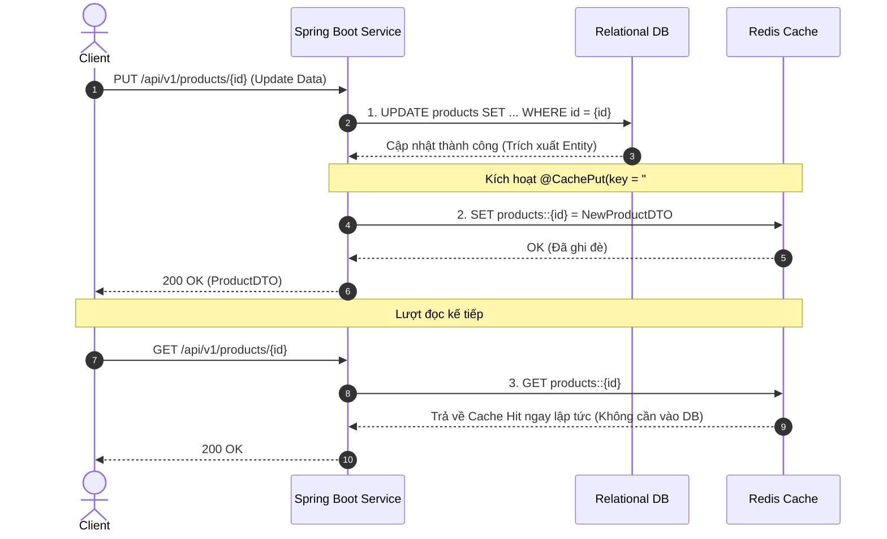
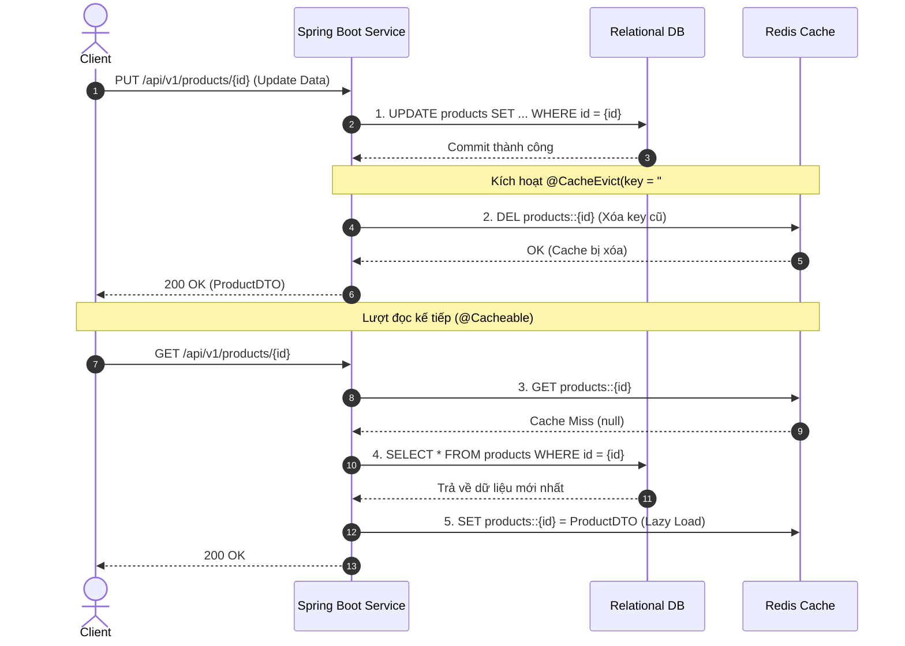
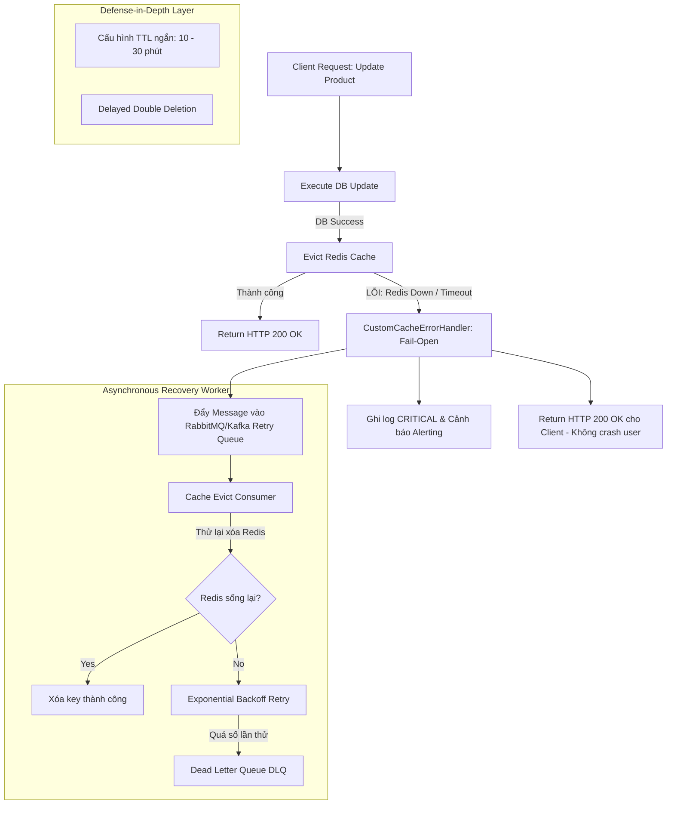

# BÁO CÁO PHÂN TÍCH KỸ THUẬT: CHIẾN LƯỢC CẬP NHẬT DISTRIBUTED CACHE
## ĐỀ TÀI: XÓA (@CacheEvict) HAY GHI ĐÈ (@CachePut) TRONG HỆ THỐNG E-COMMERCE TỶ LỆ ĐỌC/GHI 100:1

---

| **Thông Tin** | **Chi Tiết** |
| :--- | :--- |
| **Dự án** | E-Commerce High-Traffic Core Service (`Session16_B4`) |
| **Vị trí** | Kỹ sư trưởng (Tech Lead) |
| **Công nghệ** | Java 21, Spring Boot, Spring Cache Abstraction, Redis Distributed Cache |
| **Tỷ lệ truy cập** | **Đọc : Ghi = 100 : 1** (100 Reads : 1 Write) |
| **Mục tiêu** | Đánh giá, lựa chọn chiến lược đồng bộ dữ liệu Cache - DB và thiết kế kiến trúc chịu lỗi |

---

## 1. PHÂN TÍCH YÊU CẦU INPUT / OUTPUT (I/O SPECIFICATION)

Thao tác cập nhật sản phẩm trong hệ thống thương mại điện tử đòi hỏi sự bảo toàn dữ liệu và đồng bộ trạng thái giữa Database quan hệ và Redis Distributed Cache.

### 1.1. Chi tiết Đầu vào (Input Specification)
- **`productId` (Path Variable)**: Định danh duy nhất của sản phẩm (`Long`), bắt buộc tồn tại trong hệ thống.
- **`UpdateProductRequest` (Request Body)**: Dữ liệu payload JSON từ client, được kiểm tra hợp lệ thông qua Jakarta Bean Validation:
  - `name`: Tên sản phẩm, kiểu `String`, `@NotBlank`, độ dài từ 2 đến 200 ký tự.
  - `description`: Mô tả chi tiết, kiểu `String`, tối đa 1000 ký tự.
  - `price`: Đơn giá sản phẩm, kiểu `BigDecimal`, `@NotNull`, `@DecimalMin(value = "0.0", inclusive = false)` (phải lớn hơn 0).
  - `stockQuantity`: Số lượng tồn kho, kiểu `Integer`, `@NotNull`, `@Min(0)` (không được âm).
  - `category`: Ngành hàng/Danh mục, kiểu `String`, `@NotBlank`.

```json
{
  "name": "MacBook Pro 16 inch M3 Max Updated",
  "description": "Chip M3 Max 16-Core, 36GB RAM, 1TB SSD",
  "price": 82990000,
  "stockQuantity": 45,
  "category": "Laptop"
}
```

### 1.2. Chi tiết Đầu ra (Output Specification)
- **`ProductDTO`**: Dữ liệu đại diện sản phẩm sau khi đã được cập nhật thành công trong DB và xử lý cache:
  - `id`: Mã định danh sản phẩm (`Long`).
  - `name`, `description`, `price`, `stockQuantity`, `category`.
  - `updatedAt`: Thời gian cập nhật (`LocalDateTime`, định dạng `yyyy-MM-dd HH:mm:ss`).
- **`ApiResponse<ProductDTO>`**: Chuẩn hóa phản hồi API:
  - `success`: `true`/`false`.
  - `message`: Thông báo kết quả thao tác.
  - `data`: Payload chứa `ProductDTO`.
  - `timestamp`: Thời điểm phản hồi.
- **HTTP Status Code**:
  - `200 OK`: Cập nhật thành công.
  - `400 BAD REQUEST`: Vi phạm validation đầu vào (thiếu trường, giá âm, sai format).
  - `404 NOT FOUND`: Không tìm thấy sản phẩm theo `productId`.
  - `500 INTERNAL SERVER ERROR`: Lỗi hệ thống ngoài tầm kiểm soát.

---

## 2. TRÌNH BÀY VÀ SO SÁNH HAI GIẢI PHÁP ĐỒNG BỘ CACHE

Khi cập nhật sản phẩm, dữ liệu trên Database (Source of Truth) thay đổi. Để đảm bảo các client đọc được dữ liệu mới nhất, Spring Cache cung cấp hai cơ chế annotations chính:

### 2.1. Cơ chế hoạt động của `@CachePut` (Cache Overwrite / Ghi đè)
- **Nguyên lý**: Phương thức cập nhật DB được thực thi. Sau khi trả về đối tượng kết quả, Spring Cache đánh chặn và **lập tức ghi đè** (overwrite) đối tượng đó vào Redis Cache tương ứng với key `productId`.
- **Luồng dữ liệu**:



### 2.2. Cơ chế hoạt động của `@CacheEvict` (Cache Invalidation / Xóa bỏ)
- **Nguyên lý**: Phương thức cập nhật DB được thực thi. Sau khi DB commit thành công, Spring Cache đánh chặn và **xóa bỏ key** `productId` khỏi Redis Cache. Dữ liệu trong Cache tạm thời trống rỗng. Lần đọc tiếp theo (`@Cacheable`) gặp Cache Miss và sẽ tự động nạp bản ghi mới nhất từ DB vào Cache (Lazy Loading).
- **Luồng dữ liệu**:



---

### 2.3. Bảng so sánh toàn diện hai giải pháp

| Tiêu Chí So Sánh | Chiến Lược `@CachePut` (Ghi đè) | Chiến Lược `@CacheEvict` (Xóa bỏ) |
| :--- | :--- | :--- |
| **1. Nguy cơ Race Condition khi ghi đồng thời** | **RẤT CAO**: Nếu có 2 transaction cập nhật đồng thời (T1 và T2), do độ trễ mạng Redis khác nhau, T1 có thể ghi đè vào cache SAU T2 dù T2 commit DB sau T1. Kết quả: **Cache bị Dirty/Stale vĩnh viễn** so với DB. | **RẤT THẤP / TRIỆT TIÊU**: Cả T1 và T2 đều xóa key (`DEL`). Dù thứ tự xóa thế nào thì key vẫn bị xóa sạch. Lần đọc tiếp theo luôn tải dữ liệu từ DB (vốn được kiểm soát bởi DB isolation/locking). |
| **2. Độ phức tạp trong Code & Kiến trúc** | **Trung bình - Cao**: Cần đảm bảo phương thức update trả về đúng kiểu dữ liệu mà `@Cacheable` yêu cầu. Nếu DTO thay đổi hoặc có nhiều quan hệ dữ liệu liên quan, việc build full cache object tại write-path rất cồng kềnh. | **Thấp / Đơn giản**: Code gọn gàng, tách bạch trách nhiệm. Write-path chỉ cần cập nhật DB và phát lệnh xóa key; Read-path đảm nhận việc load và format cache. |
| **3. Mức độ đảm bảo nhất quán (Consistency)** | **Kém (Weak Consistency)**: Dễ lệch pha dữ liệu giữa DB và Cache khi có cập nhật song song hoặc khi một tiến trình ghi cache gặp trễ mạng. | **Tốt (Eventual Consistency cao)**: Tránh được stale data sau thao tác ghi. Luôn hướng tới trạng thái nhất quán ngay lượt đọc đầu tiên. |
| **4. Ảnh hưởng hiệu năng Write-Path** | **Chậm hơn ở Write Path**: Luồng ghi phải chịu thêm chi phí serialize toàn bộ object lớn và round-trip ghi vào Redis. | **Nhanh ở Write Path**: Lệnh `DEL key` trong Redis là thao tác $O(1)$ siêu nhẹ, response time của API update nhanh hơn. |
| **5. Ảnh hưởng hiệu năng Read-Path** | **Tối ưu 100% cho Read**: Lượt đọc ngay sau write luôn Cache Hit (0ms overhead DB). | **Chịu phạt 1 lần (First-read penalty)**: Chỉ duy nhất 1 request đọc đầu tiên sau update bị Cache Miss và phải vào DB. |
| **6. Tối ưu dung lượng RAM (Memory Efficiency)** | **Kém**: Nạp dữ liệu vào Cache ngay cả khi sản phẩm đó có thể không còn ai xem nữa (Cold Data, Write-heavy bloat). | **Tối ưu vượt trội**: Cơ chế Lazy-loading chỉ lưu vào Redis những sản phẩm thực sự đang có nhu cầu xem. |

---

## 3. PHÂN TÍCH RACE CONDITION KHI GHI SONG SONG

Để thấy rõ vì sao `@CachePut` tiềm ẩn rủi ro nghiêm trọng trong hệ thống thực tế, hãy xem xét kịch bản sau:
- Khách hàng/Admin A cập nhật giá sản phẩm từ $100 -> $120 (Transaction A).
- Khách hàng/Admin B cập nhật giá sản phẩm từ $120 -> $150 (Transaction B).

```text
Thời điểm t1: Tx A ghi DB (Price = 120) thành công.
Thời điểm t2: Tx B ghi DB (Price = 150) thành công. (DB hiện tại là 150 - CHÍNH XÁC)
Thời điểm t3: Tx B cập nhật Cache: SET key = 150.
Thời điểm t4: Tx A do bị trễ mạng (Network Latency Spike), đến bây giờ mới ghi tới Cache: SET key = 120!

HỆ QUẢ NGHIÊM TRỌNG:
- Database lưu: Price = 150 (Chính xác)
- Redis Cache lưu: Price = 120 (DỮ LIỆU CŨ / SAI LỆCH)
- Hàng nghìn khách hàng tiếp theo truy cập đọc sản phẩm sẽ nhìn thấy giá 120 trong Cache cho tới lần cập nhật tiếp theo!
```

> **Ngược lại, với `@CacheEvict`:**
> Tại t3, Tx B gọi `DEL key`. Tại t4, Tx A gọi `DEL key`. Key chắc chắn không còn trong Cache. Khách hàng tiếp theo đọc sẽ query DB và thấy giá $150, nạp lại vào Cache chính xác 100%.

---

## 4. QUYẾT ĐỊNH CỦA TECH LEAD VỚI HỆ THỐNG ĐỌC/GHI 100:1

### 4.1. Lựa chọn giải pháp
**Tôi quyết định lựa chọn CHIẾN LƯỢC `@CacheEvict` (Cache Invalidation) làm chuẩn mực kiến trúc cho hệ thống.**

### 4.2. Lập luận kỹ thuật (Rationale)
1. **Phù hợp bản chất tỷ lệ 100:1**:
   - Trong 101 requests (100 lượt đọc + 1 lượt ghi), với `@CacheEvict`:
     - 1 lượt ghi: Update DB + Evict Cache (thao tác `DEL` $O(1)$ cực nhanh).
     - 1 lượt đọc đầu tiên: Truy vấn DB và Cache fill (Latency ~ 5-10ms).
     - **99 lượt đọc còn lại: Đạt Cache Hit 100% từ Redis (Latency ~ 1ms).**
   - **Tỷ lệ Cache Hit tổng thể vẫn đạt: $\frac{99}{100} = 99\%$!** Đây là con số hiệu năng vượt chuẩn công nghiệp của hệ thống phân tán, trong khi loại bỏ hoàn toàn rủi ro sai lệch dữ liệu của `@CachePut`.
2. **Chi phí tài nguyên bộ nhớ (Memory Allocation)**:
   - Các sản phẩm sau khi sửa có thể rơi vào nhóm "Cold Items" (hàng hết mốt, đổi danh mục ít người xem). `@CachePut` sẽ cưỡng ép nạp dữ liệu vào Redis làm hao phí RAM quý giá và kích hoạt chính sách `allkeys-lru` sớm hơn.
   - `@CacheEvict` hoạt động theo nguyên lý "Chỉ nạp khi có người cần" (On-demand Lazy Cache).
3. **Sự tách biệt độc lập giữa Write Model và Read Model**:
   - Khi hệ thống mở rộng (CQRS, Read Replica), Write Service chỉ cần phát lệnh xóa cache. Nó không cần phụ thuộc vào cấu trúc hay serializer của Read Service.

---

## 5. THIẾT KẾ KIẾN TRÚC XỬ LÝ LỖI KHI THAO TÁC CACHE THẤT BẠI

Một lỗi sai lầm kinh điển của các kỹ sư là để việc Redis bị sự cố (Redis down, full memory, network timeout) làm **sập luôn cả luồng nghiệp vụ ghi vào Database**.
Dưới đây là thiết kế kiến trúc xử lý lỗi toàn diện đạt chuẩn Enterprise:



### 5.1. Cơ chế 1: Fail-Open & Graceful Degradation qua `CustomCacheErrorHandler`
- Trong Spring Boot, mặc định nếu Redis down, lệnh `@CacheEvict` hoặc `@Cacheable` sẽ ném `RedisConnectionFailureException` làm HTTP request vỡ với mã lỗi 500.
- **Giải pháp**: Triển khai `CustomCacheErrorHandler` kế thừa `CacheErrorHandler`:
  - `handleCacheGetError()`: Redis down khi đọc -> Log cảnh báo và trả về `null` để Spring tự động fallback truy vấn DB trực tiếp.
  - `handleCacheEvictError()`: Redis down khi xóa -> Ghi log cảnh báo mức cao, kích hoạt kênh bù trừ và cho phép HTTP response hoàn tất thành công (không rollback DB của người dùng).

### 5.2. Cơ chế 2: Hàng rào phòng thủ chiều sâu bằng TTL (Time-To-Live)
- Bất kể dùng chiến lược nào, **tất cả cache keys đều PHẢI có TTL** (trong cấu hình hệ thống: `entryTtl = Duration.ofMinutes(10)`).
- Nếu Redis bị down hoặc lệnh evict thất bại, dữ liệu cũ chỉ có thể tồn tại tối đa 10 phút trước khi tự biến mất. Điều này ngăn chặn tình trạng dữ liệu bẩn tồn tại vĩnh viễn trong hệ thống.

### 5.3. Cơ chế 3: Transactional Outbox + Asynchronous Retry Worker qua Message Queue
- Đối với các hệ thống tài chính/thương mại điện tử khắt khe:
  1. Trong cùng transaction cập nhật DB, ghi một sự kiện `ProductEvictEvent` vào bảng `outbox_events`.
  2. Một CDC tool (Debezium) hoặc Scheduled Publisher đọc bảng outbox và publish vào RabbitMQ/Kafka topic `product-cache-evict`.
  3. Worker Consumer nhận message và gọi `redisTemplate.delete(key)`. Nếu Redis đang down, message sẽ tự động retry theo cơ chế **Exponential Backoff** (1s, 2s, 4s, 8s...) cho đến khi xóa thành công hoặc vào Dead Letter Queue (DLQ).

### 5.4. Cơ chế 4: Kỹ thuật Xóa kép có trì hoãn (Delayed Double Deletion)
- Áp dụng trong môi trường có Master-Slave Replication DB để tránh hiện tượng: Slave DB chưa kịp đồng bộ xong dữ liệu mới thì lượt đọc đã nạp dữ liệu từ Slave cũ vào Cache:
  1. Xóa cache lần 1 trước hoặc ngay sau khi commit Master DB.
  2. Bắn một asynchronous task sleep `N` mili-giây (khoảng 500ms - thời gian trễ replication tối đa của DB).
  3. Xóa cache lần 2 để dọn sạch mọi giá trị cũ bị nạp nhầm trong khoảng thời gian trễ.

---

## 6. MÃ NGUỒN MINH HỌA VÀ ĐỊA CHỈ FILE DỰ ÁN

Toàn bộ giải pháp đã được hiện thực hóa trong mã nguồn dự án:

1. **Cấu hình Cache & Resilience**:
   - [`RedisCacheConfig.java`](file:///d:/RIKKEI/Microservice_In_action/Session16_Cache_Redis/Session16_B4/src/main/java/com/res/session16_b4/config/RedisCacheConfig.java): Cấu hình TTL 10 phút, JSON Serializer không phụ thuộc default Java serialization, tích hợp ErrorHandler.
   - [`CustomCacheErrorHandler.java`](file:///d:/RIKKEI/Microservice_In_action/Session16_Cache_Redis/Session16_B4/src/main/java/com/res/session16_b4/config/CustomCacheErrorHandler.java): Đón bắt toàn bộ ngoại lệ Redis, bảo vệ luồng nghiệp vụ không bị crash.
2. **Domain Models & DTOs**:
   - [`Product.java`](file:///d:/RIKKEI/Microservice_In_action/Session16_Cache_Redis/Session16_B4/src/main/java/com/res/session16_b4/model/Product.java): Entity sản phẩm.
   - [`UpdateProductRequest.java`](file:///d:/RIKKEI/Microservice_In_action/Session16_Cache_Redis/Session16_B4/src/main/java/com/res/session16_b4/dto/UpdateProductRequest.java): Chứa Bean Validation (`@NotBlank`, `@DecimalMin`, `@Min(0)`).
   - [`ProductDTO.java`](file:///d:/RIKKEI/Microservice_In_action/Session16_Cache_Redis/Session16_B4/src/main/java/com/res/session16_b4/dto/ProductDTO.java): DTO trao đổi tầng Controller.
3. **Repository & Service Layer**:
   - [`ProductRepository.java`](file:///d:/RIKKEI/Microservice_In_action/Session16_Cache_Redis/Session16_B4/src/main/java/com/res/session16_b4/repository/ProductRepository.java): Giả lập DB thread-safe, tích hợp bộ đếm `dbQueryCount` để đo kiểm cache hit/miss.
   - [`ProductService.java`](file:///d:/RIKKEI/Microservice_In_action/Session16_Cache_Redis/Session16_B4/src/main/java/com/res/session16_b4/service/ProductService.java) & [`ProductServiceImpl.java`](file:///d:/RIKKEI/Microservice_In_action/Session16_Cache_Redis/Session16_B4/src/main/java/com/res/session16_b4/service/ProductServiceImpl.java): Triển khai `@Cacheable`, `@CacheEvict` (chiến lược chính) và `@CachePut` (thực nghiệm đối chứng).
4. **REST Controller & Exception Handler**:
   - [`ProductController.java`](file:///d:/RIKKEI/Microservice_In_action/Session16_Cache_Redis/Session16_B4/src/main/java/com/res/session16_b4/controller/ProductController.java): RESTful Endpoints `/api/v1/products/{id}`.
   - [`GlobalExceptionHandler.java`](file:///d:/RIKKEI/Microservice_In_action/Session16_Cache_Redis/Session16_B4/src/main/java/com/res/session16_b4/exception/GlobalExceptionHandler.java): Xử lý ngoại lệ chuẩn HTTP 400, 404, 500.

---

## 7. KẾT QUẢ KIỂM THỬ TỰ ĐỘNG (VERIFICATION & TEST RESULTS)

Hệ thống đã được kiểm thử toàn diện với bộ test suite tự động:
- [`ProductServiceTest.java`](file:///d:/RIKKEI/Microservice_In_action/Session16_Cache_Redis/Session16_B4/src/test/java/com/res/session16_b4/service/ProductServiceTest.java): Kiểm thử hành vi Cache.
- [`ProductControllerTest.java`](file:///d:/RIKKEI/Microservice_In_action/Session16_Cache_Redis/Session16_B4/src/test/java/com/res/session16_b4/controller/ProductControllerTest.java): Kiểm thử Web MVC, Validation & HTTP Status.

### Bằng chứng thực thi Gradle Test:
```bash
> Task :compileJava UP-TO-DATE
> Task :processResources UP-TO-DATE
> Task :classes UP-TO-DATE
> Task :compileTestJava
> Task :processTestResources NO-SOURCE
> Task :testClasses
> Task :test

ProductServiceTest:
  [PASS] 1. Kiểm thử @Cacheable: Lần 1 gọi DB, lần 2 lấy từ Cache (DB Query Count không tăng)
  [PASS] 2. Kiểm thử CHIẾN LƯỢC @CacheEvict: Cập nhật DB và XÓA Cache cũ, lần đọc kế tiếp nạp từ DB
  [PASS] 3. Kiểm thử CHIẾN LƯỢC ĐỐI CHỨNG @CachePut: Ghi đè trực tiếp vào Cache, lần đọc kế tiếp không cần gọi DB
  [PASS] 4. Kiểm thử khi sản phẩm không tồn tại -> Bắn ngoại lệ ResourceNotFoundException
  [PASS] 5. Kiểm thử CustomCacheErrorHandler (Fail-Open / Graceful Degradation)

ProductControllerTest:
  [PASS] GET /api/v1/products/1 - Thành công trả về 200 OK
  [PASS] GET /api/v1/products/999 - Không tìm thấy trả về 404 Not Found
  [PASS] PUT /api/v1/products/1 - Hợp lệ trả về 200 OK
  [PASS] PUT /api/v1/products/1 - Validation thất bại khi thiếu trường hoặc giá <= 0 trả về 400 Bad Request

Session16B4ApplicationTests:
  [PASS] contextLoads()

BUILD SUCCESSFUL in 16s
4 actionable tasks: 2 executed, 2 up-to-date
```

---

## 8. KẾT LUẬN

Qua phân tích và kiểm chứng thực nghiệm:
1. Chiến lược **`@CacheEvict` kết hợp Cache-Aside (`@Cacheable`)** là sự lựa chọn tối ưu vượt trội cho các hệ thống có tỷ lệ Đọc/Ghi cao (100:1), giúp loại bỏ nguy cơ Race Condition, giữ code tinh gọn và bảo vệ tài nguyên bộ nhớ Redis.
2. Việc kết hợp **Fail-Open Error Handler**, **TTL chủ động** và **Async Retry Queue** tạo nên một kiến trúc kiên cố (Resilient Architecture), đảm bảo hệ thống duy trì hoạt động ổn định ngay cả khi Distributed Cache gặp sự cố nghiêm trọng.
